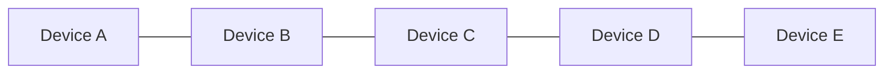
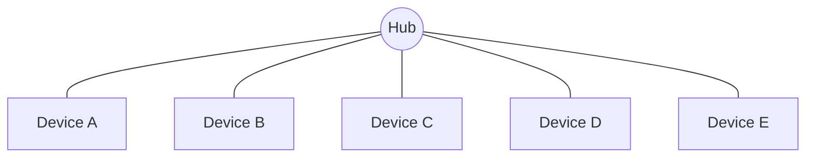
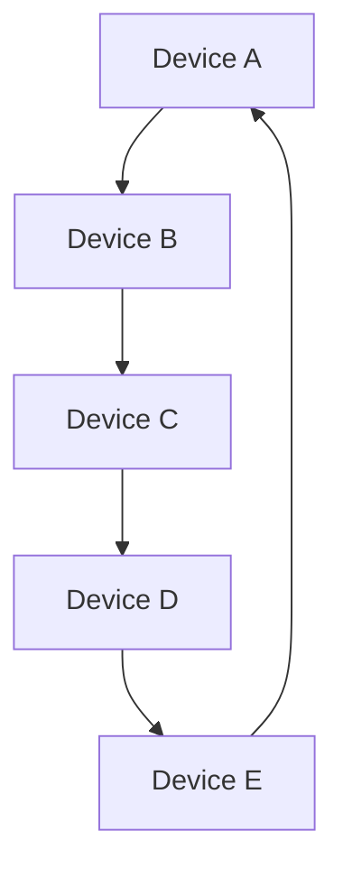
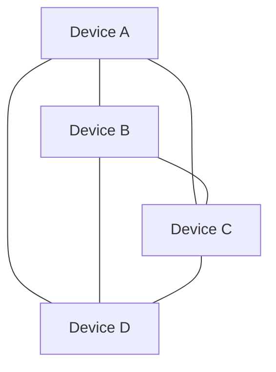
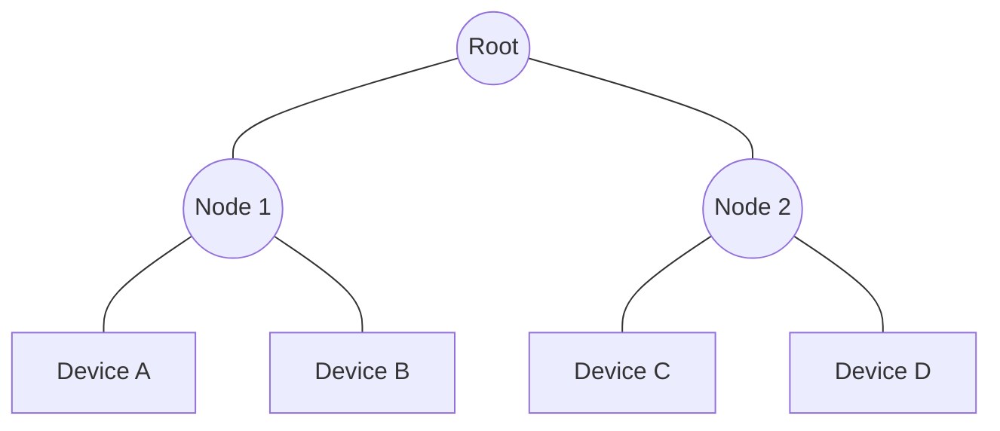

# Understanding Network Topology

Network topology refers to the arrangement of various elements (links, nodes, etc.) in a computer network. It defines how different devices are connected and how they communicate with each other. Let's explore some common network topologies.

## 1. Bus Topology

In a bus topology, all devices are connected to a single cable, called the bus or backbone.

**Advantages:**
- Easy to install and configure
- Requires less cable than other topologies

**Disadvantages:**
- If the main cable fails, the entire network goes down
- Performance degrades as more devices are added

## 2. Star Topology

In a star topology, all devices are connected to a central hub or switch.

**Advantages:**
- Easy to install and wire
- If one connection fails, only that device is affected

**Disadvantages:**
- Requires more cable than bus topology
- If the central hub fails, the entire network goes down

## 3. Ring Topology

In a ring topology, each device is connected to exactly two other devices, forming a ring.

**Advantages:**
- Easy to install and reconfigure
- Performs better than bus topology under heavy network load

**Disadvantages:**
- If one device or connection fails, the entire network can be affected
- Adding or removing devices can disrupt the network

## 4. Mesh Topology

In a mesh topology, each device is connected to every other device in the network.

**Advantages:**
- Highly reliable: multiple paths between devices
- Efficient data transfer

**Disadvantages:**
- Expensive to implement due to the number of connections
- Complex to set up and maintain

## 5. Tree Topology

A tree topology is a combination of bus and star topologies. It has a hierarchical structure with a root node and child nodes.

**Advantages:**
- Scalable and easy to extend
- Suitable for large networks

**Disadvantages:**
- If the root node fails, large parts of the network can be affected
- Can be complex to manage as the network grows

Each topology has its own strengths and weaknesses, and the choice depends on factors such as the size of the network, budget, and specific requirements of the organization.
